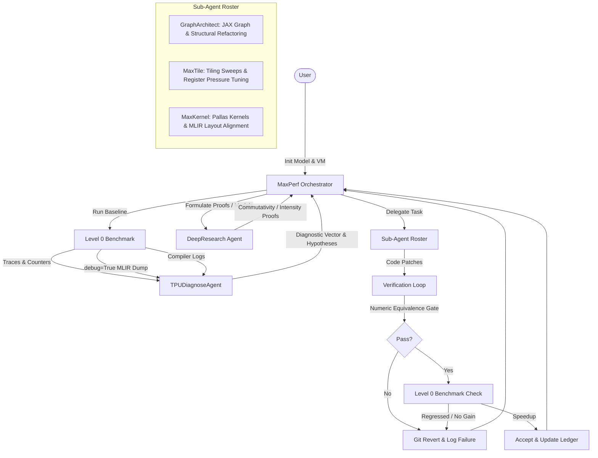

<!-- disableFinding(LINK_RELATIVE_G3DOC) -->
<!-- disableFinding(LINE_OVER_80) -->
<!-- disableFinding(LIST_NO_LINE) -->
<!-- disableFinding(SNIPPET_EM_DASH) -->
<!-- disableFinding(WHITESPACE_LINES) -->
<!-- disableFinding(SPACES) -->
<!-- disableFinding(HTML_OPEN) -->
<!-- disableFinding(HTML_BROKEN) -->

# MaxPerf: Multi-Agent TPU Optimization System Design Document

This document outlines the architecture, orchestration flow, and sub-agent roles of **MaxPerf**, an agentic performance optimization system designed to accelerate Large Language Model (LLM) serving workloads on Google Cloud TPUs.

---

### 1. System Overview

MaxPerf is a closed-loop, hypothesis-driven optimization framework. It automates the process of profiling JAX/Pallas workloads on TPU accelerators, identifying bottleneck sources, formulating theoretical and empirical performance hypotheses, implementing code-level optimizations, and verifying accuracy and throughput.

To diagnose bottlenecks accurately without losing program structure, MaxPerf utilizes a **Mosaic-first Dual-Rung** diagnostic approach:
1.  **Mosaic MLIR (Primary Rung)**: Intercepts compiler layout, tiling, and pipelining decisions while program loop nests and tensor dimensions are still recognizable.
2.  **LLO IR & Compiler Logs (Specialized Rung)**: Evaluates register allocation (VREG spills) and VLIW slot scheduling after the program has been flattened.



---

## 2. Sub-Agent Roster & Roles

MaxPerf delegates optimization tasks to six specialized sub-agents based on the nature of the identified performance bottleneck.

### 2.1 MaxPerf Orchestrator
*   **Role**: Coordinates the entire lifecycle of the optimization session. Manages the hypothesis queue, coordinates agent handoffs, performs code promotions/reverts, and updates performance ledgers.
*   **Aesthetics & Style**: Autonomous, minimizing user confirmations. Executes steps proactively and updates `experiments/e2e_optimization_results.md` and `RESULTS.tsv` continuously.

### 2.2 TPU Diagnose (`TPUDiagnoseAgent`)
*   **Role**: Performance profiling and trace diagnostic engine. Executes after measurement runs to produce a structured **Diagnostic Vector** representing the system's performance fingerprint.
*   **Inputs**: xprof traces, Mosaic MLIR modules (from `debug=True` runs), XLA compiler logs, and HBM bandwidth counters.
*   **Outputs**:
    *   **Diagnostic Vector**: Structured metrics including:
        *   **Roofline analysis**: Compute vs. memory-bound, distance from peak (%), binding resource.
        *   **Headroom report**: Hottest operations mapping.
        *   **Mosaic Diagnostics**: Visualizing layout transposes/relayouts, loop double-buffering overlap, and VMEM bounds directly from the MLIR.
        *   **LLO Diagnostics**: VREG spill count and VLIW dual-issue density (from logs).
    *   **Hypothesis Filings**: Profile-grounded hypotheses placed at the top of the queue if regressions or >5% inefficiencies are detected.

### 2.3 Symbolic Reasoner (`DeepResearch`)
*   **Role**: Analytical and symbolic reasoning sub-agent. Focuses on theoretical optimization formulations. Does not write code.
*   **Inputs**: Pre- and post-optimization HLO dumps, JAX program traces, and hardware profile JSONs.
*   **Outputs**:
    *   **Commutativity Proofs**: Formulations showing that operations commute (e.g., reduction and collectives), allowing payload minimization.
    *   **Operational Intensity Derivations**: FLOPs/Byte calculations compared against hardware ridge points to prove memory vs. compute boundness.
    *   **Mesh Layout Proposals**: Parallel sharding dimension ratios (TP/DP/PP/EP) derived mathematically to bypass interconnect bottlenecks.

### 2.4 JAX Graph Architect (`GraphArchitect`)
*   **Role**: Handles JAX/Flax Python-level graph modifications, sharding layouts, weight synchronization, and structural barrier-removal refactorings.
*   **Inputs**: Pre- and post-optimization HLO dumps, Python source files, Mosaic MLIR modules, LLO IR assemblies, and DeepResearch derivations/proofs.
*   **Outputs**:
    *   JAX/Flax Python-level code refactors (eliminating runtime branches, specialized frozen configs, dynamic indexing removal).
    *   JAX/Flax parallelization layout updates (relocating collectives/reductions, PartitionSpec configurations, and sequence Ring-Attention loops).
    *   Mandatory 100-prompt numeric-equivalence validation results.
    *   Pre/post HLO diffs demonstrating successful compilation changes.

### 2.5 Tiling & Autotuning (`MaxTile`)
*   **Role**: Tile-size optimization and autotuning agent. Focuses on tuning tile shapes for memory and compute load balance across hardware execution units.
*   **Inputs**: Roofline boundary models, operational intensity derivations, and VREG spill reports from LLO.
*   **Outputs**:
    *   Tuning configurations optimized algebraically or through highly bounded empirical sweeps (max 8 configurations) to balance pipeline stages.
    *   **VREG Balance**: Shrinks tile sizes dynamically when register spills are detected in LLO logs until loops fit into physical registers.

### 2.6 Custom Pallas Kernels (`MaxKernel`)
*   **Role**: Authors custom low-level JAX Pallas kernels for operations where XLA compiler fusion fails or where standard JAX indexing constructs degrade performance.
*   **Inputs**: HLO scope test reports, Mosaic MLIR modules, xprof traces, and ISA documentation.
*   **Outputs**:
    *   Low-level Pallas kernels targeting memory-bound gather/scatter patterns, dynamic-tiled GEMMs, or ragged attention structures.
    *   **MLIR Layout Verification**: Validates that vector operations match native sublane shapes (8, 128) and does not trigger lane shuffles (relayouts).
    *   **MLIR Pipelining Verification**: Validates that DMA copies are successfully double-buffered (async copy issued ahead of current compute loop).

---

## 3. Core Orchestration Lifecycle

Each optimization iteration follows a structured, automated validation pipeline:

```
[Pull Hypothesis] ──> [Handoff Sub-Agent] ──> [Apply Code Patch]
                                                     │
[Record Win & Ledger] <── [Verify Perf] <── [Pass Equivalence Gate]
       │                         │                   │
  (Speedup > 1%)            (Regress / No Gain)    (Fail)
       │                         │                   │
       v                         v                   v
[Promote to Main]           [Git Revert]        [Git Revert]
```

### 3.1 Session Initialization
1.  Initialize session status and target metadata in `session.json`.
2.  Capture baseline serving metrics (throughput, TTFT, TPOT) on the target TPU VM.
3.  Establish Phase 0 diagnostic vector as the baseline reference.

### 3.2 The Numeric Equivalence Gate (Hard Constraint)
Before any throughput measurements are reported or accepted, the modified code must pass a **100-prompt numeric equivalence comparison**.
*   **Tolerance**: Absolute matching tolerances (typically `1e-2` for `bf16` precision) are checked across output logit accumulators.
*   **Failure Handling**: If the check fails, the experiment is instantly flagged as rejected and the code is reverted via `git checkout`.

### 3.3 Performance Verification & Revert
*   If numeric equivalence passes, the Level 0 benchmark runs serving traffic to measure throughput (Tokens/sec/Chip) and latencies.
*   **Autorevert**: If the measured performance regresses or fails to improve performance by a minimum threshold (typically 1%), the orchestrator immediately reverts the branch.

---

## 4. Key Agent Protocols

To guarantee systematic and predictable execution, sub-agents adhere to formal verification protocols:

### 4.1 The HLO Scope Test (MaxKernel)
Prior to writing any custom Pallas kernel, **MaxKernel** must run an HLO analysis. If the post-compiler HLO indicates that XLA has already automatically fused the target operator group, a custom kernel is deemed *out-of-scope* and rejected pre-implementation to prevent code bloating.

### 4.2 The Mosaic MLIR Verification Protocol (MaxKernel & TPUDiagnose)
Before benchmarking custom kernels, the implementation must be analyzed at the Mosaic MLIR level by compiling with `debug=True`:
1.  **Relayout Scan**: Check the MLIR module for vector transposes or shuffles between adjacent operations. If any layout cast is found, rewrite the tensor layouts to align them and eliminate layout permute overhead.
2.  **DMA Pipelining Check**: Confirm that loop structures utilize async copies (`pltpu.async_copy`) such that data block $n+1$ is fetched in parallel with compute block $n$.
3.  **VMEM Budget Check**: Confirm that statically allocated vector memory buffers fit comfortably within the generation's budget (e.g. 96 MiB on v6e) to prevent compile-time OOMs.

### 4.3 Iterative Constraint Narrowing (MaxKernel Self-Debug)
When a custom kernel compilation fails, MaxKernel enters a structured self-debug loop:
1.  Read the low-level compiler/runtime error trace.
2.  Identify the exact hardware rule violated (e.g., sublane divisibility constraints).
3.  Document the rule as a hard constraint in `constraint_log.md`.
4.  Rewrite the kernel to respect the accumulated constraint set.
5.  Max limit: 5 iterations. If compilation fails at iteration 5, the hypothesis is refuted.

### 4.4 Compile-Time Specialization Ladder (`GraphArchitect`)
GraphArchitect resolves execution barriers using a priority-ordered specialization ladder, preferring the highest possible optimization level:
1.  **Level A (Python Parse Time)**: Values resolved statically before tracing (e.g., frozen dataclasses).
2.  **Level B (JAX Trace Time)**: Branch resolution during trace time (eliminating HLO generation).
3.  **Level C (XLA Compile Time)**: Constants embedded directly into the HLO graph.
4.  **Level D (Runtime)**: Elementwise selections using `jnp.where` or `lax.cond` (retains HLO structure but allows fusion).

### 4.5 TPU Compiler Lowering Constraints (Pallas Custom Kernels)
When compiling Pallas custom kernels on TPUs, the developer or sub-agent must respect the following strict compiler lowering constraints to avoid compilation failures or hardware halts:
1.  **The 128-Element Rule (Sublane Alignment)**: Vector loads/stores must be statically provable to be aligned to 128-element boundaries. Any sliced index offset or block dimension must be a multiple of 128.
2.  **Metadata Padding for Dynamic Indexing**: Loading dynamic indexing metadata from a VMEM array (e.g. `slices_ref[i, col]`) requires the last dimension of the metadata array to be padded to a multiple of 128 (e.g., shape `(32, 128)` instead of `(32, 3)`). This allows the compiler to prove that the column load is aligned to a 128-element boundary (vector load + extract).
3.  **HBM vs. VMEM Isolation (Memory Space Restrictions)**: TPU hardware prohibits direct load/store slice assignments on memory references residing in HBM (`MemorySpace.ANY`). HBM references can only be copied to/from local Vector Memory (VMEM) using `pltpu.sync_copy(src_ref, dst_ref)` or `pltpu.async_copy(src_ref, dst_ref, sem)`.
4.  **Static index_map Constraint**: The `index_map` callable of a `BlockSpec` is executed at trace-time and must not capture dynamic JAX arrays (free variables) from the outer scope. For ragged or dynamic layouts, pass the HBM array references directly to the kernel and slice them using `.at[...]` view references and `sync_copy` inside the kernel loop.


---

## 5. Session Management & Persistence

To maintain session integrity across VM maintenance events, reboots, and multi-agent runs, MaxPerf implements a robust session persistence layer:

### 5.1 ADK Session Database
The ADK web server (`adk web`) runs as a daemon and backs all active user sessions into a local SQLite database on the TPU VM:
*   **Path**: `/home/gvanica_google_com/MaxKernel/session_info/sessions.db`
*   **Purpose**: Records session entities, trace paths, current states, and chronological agent event logs.

### 5.2 Attempt Logs Serialization
At the conclusion of each optimization run attempt (successful or failed), the session state and full event list (including model outputs, compiler traces, and compilation check results) are serialized to a JSON file in the target task dataset directory:
*   **Path**: `~/custom_dataset/<task_id>/session_attempt_<N>.json`
*   **Structure**: Tracks fields like `appName`, `state` (containing active kernel paths, compilation status, best iteration latency), and `events` (a list of all agent interactions).

---

## 6. Report Writing & Ledger Management

MaxPerf maintains historical documentation and audit trails through three main ledger files:

### 6.1 Results Ledger (`RESULTS.tsv`)
A tab-separated values ledger stored at the root of the workspace (`RESULTS.tsv`).
*   **Columns**: Chronological index, stage name, parameters, throughput metrics, latency metrics, speedup ratio, and verdict status.
*   **Behavior**: Orchestrator appends results automatically after each successful Phase 0 or Phase 1 verification run.

### 6.2 Chronological End-to-End Log (`experiments/e2e_optimization_results.md`)
A premium markdown chronicle detailing the optimization journey.
*   **Content**: Lists optimization stages, throughput progression curves, technical details of applied hypotheses (e.g., GQA Broadcast Fusion, MLP alignment padding), performance ledger tables, and sub-agent role attributions.
*   **Writing Protocol**: Autored and appended by the orchestrator at the completion of verification runs.

### 6.3 Final Session Summary (`session_summary.md`)
At the conclusion of the session (when the queue is exhausted or the user requests to halt):
1.  The orchestrator compiles all results into `experiments/session_summary.md`.
2.  The report lists all evaluated hypotheses, final win status (accepted vs. refuted), throughput deltas, and median latency reductions.
3.  The final configurations are archived in a production-ready folder.

