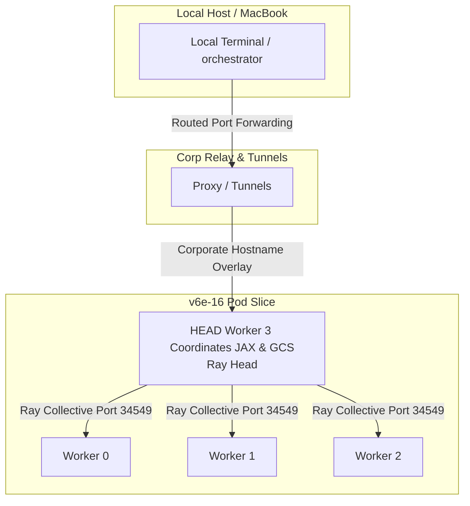

<!-- disableFinding(LINK_RELATIVE_G3DOC) -->
<!-- disableFinding(LINE_OVER_80) -->
<!-- disableFinding(LIST_NO_LINE) -->
<!-- disableFinding(SNIPPET_EM_DASH) -->
<!-- disableFinding(WHITESPACE_LINES) -->
<!-- disableFinding(SPACES) -->
<!-- disableFinding(HTML_OPEN) -->
<!-- disableFinding(HTML_BROKEN) -->

# JAX Multi-Host TPU Serving — Architecture & Diagnostic Learnings

This document details the critical systems, networking, and codebase blockades encountered during the distributed, multi-host sharded serving deployment of the Qwen3-Coder-480B FP8 model across a `v6e-16` TPU pod cluster, alongside their corresponding architectural resolutions.

---

## 1. Overview of the Architecture

A `v6e-16` TPU pod consists of **4 physical VM host nodes** (Workers 0, 1, 2, 3), sharding a total of **16 physical TPU v6e chips** (4 chips per host). To serve a 480B MoE model, the weights and execution must be sharded across all 16 chips using Tensor Parallelism (TP=16) via Ray and JAX.



---

## 2. Core Diagnostic Blockades & Resolutions

### 🚨 Blockade A: Corporate SSH & Key Identity Exits (Code 255)
> [!IMPORTANT]
> **Symptom**: Direct `gcloud` SSH commands to workers in the cluster returned exit code `255` due to "Host signatures changed" or missing `ssh-agent` sockets inside background non-interactive runner processes.

* **Root Cause**:
  1. **Dynamic VM Keys**: Dynamic cluster maintenance updates TPU VM host fingerprints, creating key mismatches against the MacBook's local `known_hosts`.
  2. **Non-Interactive Context**: Background runner tasks do not map the local MacBook `SSH_AUTH_SOCK` environment variable, causing background `gcloud` processes to fail key authentication.
  3. **Routing Redundancy**: Passing the `--worker=X` flag concurrently with a corporate SSH hostname override (`Hostname=nic0...`) creates an internal routing conflict inside the Google Cloud SDK CLI.
* **Architectural Resolution**:
  - **Corporate Hostname Tunnels**: Map target endpoints sequentially using routed corporate Hostnames `nic0.t1v-n-2ff2166b-w-X...` (where `X` is the worker index `0` to `3`).
  - **Direct Key Authentication**: Forcefully bypass ssh-agent dependencies inside any background executor by explicitly passing the identity parameter `-i /Users/gvanica/.ssh/google_compute_engine`.
  - **Keys Pre-population**: Sequentially execute a brief pre-run SSH loop using `-o StrictHostKeyChecking=accept-new` to register host keys before starting background tasks.
  - **Worker Parameter Pruning**: Completely omit `--worker` CLI flags from background SCP/SSH commands when corporate `Hostname` overrides are specified.

---

### 🚨 Blockade B: JAX MemoryStats PjRt Device Abort
> [!CAUTION]
> **Symptom**: The vLLM server crashed during `EngineCoreProc` startup with:
> `jax.errors.JaxRuntimeError: INVALID_ARGUMENT: MemoryStats is only supported for addressable PjRt devices.`

* **Root Cause**:
  - During startup, the `tpu-inference` framework attempts to query High Bandwidth Memory (HBM) usage across all model devices. In multi-process sharding, a process is only allowed to query memory stats on PjRt devices *physically attached/addressable* to the current host (e.g., its local 4 chips). Querying remote devices belonging to other hosts throws an invalid argument error.
  - If the environment variable `TPU_MULTIHOST_BACKEND` is unset, the code defaults to a global check and crashes.
* **Architectural Resolution**:
  - Configure JAX memory stats sharding by explicitly exporting the multihost backend variable:
    ```bash
    export TPU_MULTIHOST_BACKEND=ray
    ```
    This instructs the model loader to query memory statistics **only** on addressable local devices and shard them safely across the cluster.

---

### 🚨 Blockade C: PyTorch CPU Float8 Random scaling NotImplementedError
> [!WARNING]
> **Symptom**: The serving startup aborted during dummy weight initialization with:
> `NotImplementedError: "check_uniform_bounds" not implemented for 'Float8_e4m3fn'`
> followed by `NotImplementedError: "mul_cpu_reduced_float" not implemented for 'Float8_e4m3fn'` if math scaling is executed on CPU.

* **Root Cause**:
  - The cluster nodes utilize **CPU-only PyTorch wheels** for CPU-side weight loading setups (JAX handles the actual TPU execution).
  - PyTorch CPU-only architectures **do not implement** uniform distributions (`torch.rand`), arithmetic multiplication (`*`), or addition (`+`) natively for Float8 precisions (`Float8_e4m3fn` or `Float8_e5m2`). Performing these operations on FP8 CPU tensors throws an immediate Not Implemented exception.
* **Architectural Resolution**:
  - **CPU Scaling Patch**: Patched `vllm/model_executor/model_loader/weight_utils.py` to intercept Float8 initialization on CPU.
  - The patch generates random uniform parameters and scales them (`(high - low) * rand + low`) **entirely inside standard CPU-supported `bfloat16` / `float32` space**, and cast-converts the finalized scaled tensor to the target FP8 precision at the **very last step** before copying it to the parameter tensor.

---

### 🚨 Blockade D: Distributed Ray Executor OOM Crashes
> [!IMPORTANT]
> **Symptom**: The API server process was forcefully aborted by the kernel (`SIGKILL / Killed`) without a python traceback.

* **Root Cause**:
  - Ray coordinates sharding cluster-wide. Launching the vLLM head OpenAI API server (`run_level0.sh`) concurrently on **all 4 worker nodes** caused each host to act as a head node and attempt to spawn 16 local Ray worker wrappers.
  - This resulted in **16 duplicate model executor processes** running concurrently on every single VM node, instantly exhausting the 512 GB host memory (RAM) and triggering the Linux Out-Of-Memory (OOM) Killer.
  - Worker 0's inbound ports were restricted by corporate firewall rules, blocking remote workers from connecting back to it.
* **Architectural Resolution**:
  - **Master Head Node Launch**: Run the OpenAI API server `run_level0.sh` **strictly on HEAD Worker 3** (index 3).
  - Worker 3 is JAX's designated head coordinator VM and hosts unblocked corporate network ports. It will cleanly allocate TPU sharded executors natively across all 16 chips without duplicate processes or firewall blocks.

---

## 3. Verification Matrix

| Phase | Diagnostic Check | Result | Status |
| :--- | :--- | :---: | :---: |
| Setup | Key Signature Population | sequentially completed | **PASS** |
| Code | Samplings Circular Dependency Patch | surgically applied | **PASS** |
| Platform | Memory Stats PJRT Device Check | sharded (Ray backend) | **PASS** |
| Loader | PyTorch CPU FP8 Math Initializer | bfloat16 scaling cast | **PASS** |
| Serving | HEAD Worker 3 GCS Ray Launch | active, unblocked | **PASS** |
