# Hypothesis 4 Exploration: Pipelining Quantized Matmul (MXU) and Dequantization (VPU)

This artifact presents a detailed algebraic derivation, hardware latency model, and pipeline stage balancing analysis for **Hypothesis 4 (Pipelined quantized matmul and dequantization)**.

---

## 📋 Problem Statement & Observation

Weight-only quantization (e.g. `int8` or `int4` weights with `bfloat16` activations) is a key technique to reduce HBM bandwidth pressure during the LLM decode phase. 

In a standard quantized GEMM (General Matrix Multiply) Pallas kernel:
1.  **HBM-to-VMEM**: Quantized weights are loaded into VMEM as `int8`.
2.  **Dequantization**: The VPU (Vector Processing Unit) scales/offsets the `int8` weights to `bfloat16`.
3.  **Matrix Multiplication**: The MXU (Matrix Execution Unit) performs matrix multiplication using the dequantized `bfloat16` weights.

If executed sequentially within the loop body, the MXU stalls while waiting for the VPU to finish dequantization, and the VPU remains idle during the matmul phase.

---

## 💡 Algebraic Latency Model

Let the block dimensions of the tile be:
*   $B_m$: Row dimension of activation tile.
*   $B_k$: Reduction dimension of activation/weight tile.
*   $B_n$: Column dimension of weight tile.

The weight block contains $B_k \times B_n$ elements.
Since the weights are quantized in `int8` format, the block occupies:
$$\text{Size}_{\text{int8}} = B_k \times B_n \text{ bytes in VMEM}$$
Dequantizing it to `bfloat16` expands the block to:
$$\text{Size}_{\text{bf16}} = 2 \times B_k \times B_n \text{ bytes in VMEM}$$

Let's model the latency of a single tile reduction step:

1.  **DMA Transfer Time ($T_{\text{DMA}}$)**:
    $$T_{\text{DMA}} = \frac{B_k \times B_n}{\text{BW}_{\text{HBM}}}$$
    where $\text{BW}_{\text{HBM}}$ is the HBM read bandwidth.

2.  **VPU Dequantization Time ($T_{\text{VPU}}$)**:
    Let $\text{TP}_{\text{VPU}}$ be the VPU throughput in elements/cycle.
    $$T_{\text{VPU}} = \frac{B_k \times B_n}{\text{TP}_{\text{VPU}}}$$

3.  **MXU Matmul Time ($T_{\text{MXU}}$)**:
    Let $\text{TP}_{\text{MXU}}$ be the MXU throughput in Multiply-Accumulate (MAC) operations per cycle.
    $$T_{\text{MXU}} = \frac{B_m \times B_k \times B_n}{\text{TP}_{\text{MXU}}}$$

---

## ⚙️ Pipeline Stage Balancing (Overlapping VPU and MXU)

By utilizing double-buffered registers and asynchronous memory transfers, we can overlap the operations of the three independent hardware units (DMA, VPU, and MXU).

### Pipelined Loop Structure (Step $k$)
For step $k$ of the reduction dimension loop:
1.  **DMA Unit**: Asynchronously loads quantized weight block $k+1$ from HBM to `w_int8_buf[(k + 1) % 2]`.
2.  **VPU Unit**: Converts quantized weight block $k$ in `w_int8_buf[k % 2]` to `bfloat16` in `w_bf16_buf[k % 2]`.
3.  **MXU Unit**: Multiplies activation block $k-1$ with dequantized weight block $k-1$ in `w_bf16_buf[(k - 1) % 2]`.

```mermaid
gantt
    title Pipelined Execution Flow
    dateFormat  X
    axisFormat %s
    section DMA Load (HBM->VMEM)
    Block 0 :active, 0, 5
    Block 1 : 5, 10
    Block 2 : 10, 15
    section VPU Dequant
    Block 0 : 5, 10
    Block 1 : 10, 15
    section MXU Matmul
    Block 0 : 10, 15
```

### Latency Comparison
*   **Sequential Loop Time** (for $K$ reduction steps):
    $$T_{\text{seq}} = K \times \left( T_{\text{DMA}} + T_{\text{VPU}} + T_{\text{MXU}} \right)$$
*   **Pipelined Loop Time**:
    $$T_{\text{pipelined}} = K \times \max\left( T_{\text{DMA}}, T_{\text{VPU}}, T_{\text{MXU}} \right) + \text{Overhead}$$

### Speedup Derivation
Assuming the kernel is compute-bound by the MXU ($T_{\text{MXU}} \ge T_{\text{DMA}}$ and $T_{\text{MXU}} \ge T_{\text{VPU}}$):
$$\text{Speedup} = \frac{T_{\text{seq}}}{T_{\text{pipelined}}} \approx 1 + \frac{T_{\text{DMA}} + T_{\text{VPU}}}{T_{\text{MXU}}}$$

---

## 📋 Hypothesis Filing (deep_research Output)

- **Class:** `kernel-novel`
- **Origination:** Profile
- **Author:** MaxKernel (Pallas kernel implementation)
- **Evidence:** VPU vs MXU resource parallelism tables under TPU v6e ISA.
- **Expected Gain:** **10% to 25%** increase in MXU utilization; **3% to 7%** reduction in end-to-end latency.
- **Accept/Reject Criteria:** Matmul stage latency matches $\max\left( T_{\text{DMA}}, T_{\text{VPU}}, T_{\text{MXU}} \right)$ within 5% tolerance.
