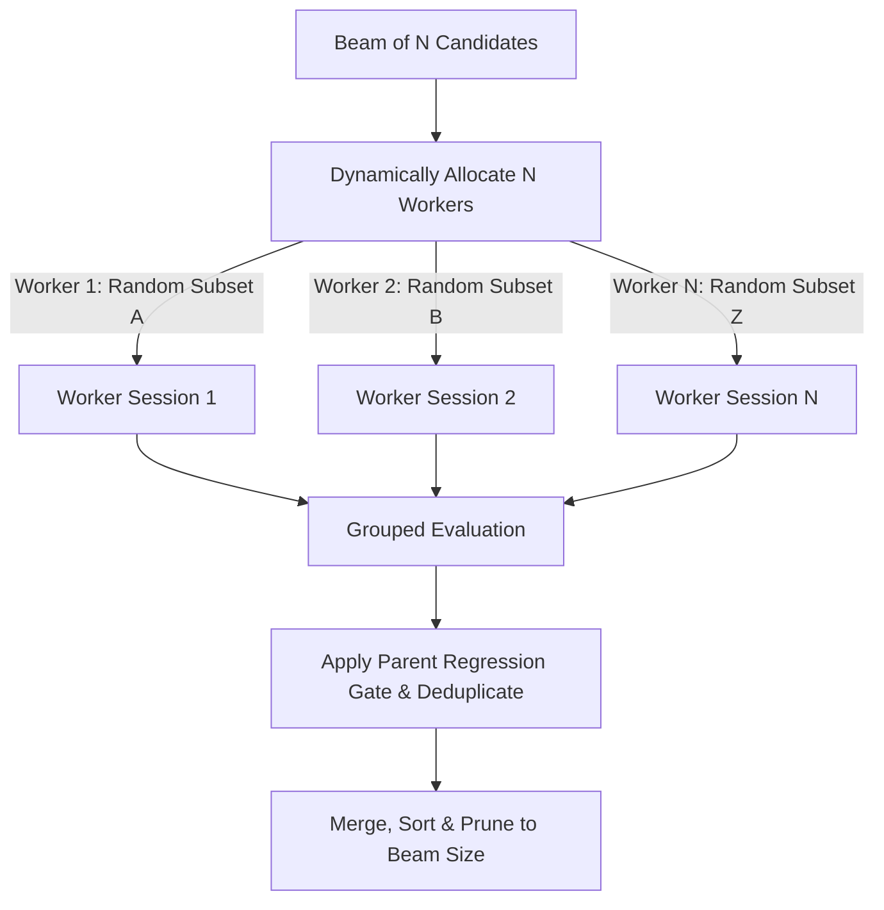

# Design Doc: Dynamic Beam Search Expansion with Stochastic Focus Menu

This document outlines the design and implementation plan to expand the Beam Search orchestrator (`beam_search/orchestrator.py`) in `MaxKernel` by adapting the stochastic menu dropout strategy and TPU-specific focus strategies from the `autocomp` repository.

---

## 1. Objectives
- **Dynamic Width Scaling**: Scale the number of parallel worker sessions dynamically based on the configured `beam_size`.
- **TPU/Pallas Optimization Menu**: Import all 35 TPU-specific optimization strategies defined in `autocomp`.
- **Stochastic Menu Dropout**: Apply a random dropout filter (probability `p = 0.5`) to the global menu for each worker, generating a unique checklist in each worker's prompt to ensure diverse search directions.
- **Parent Regression budget gate**: Track the parent latency for each candidate and prune candidates that regress in performance compared to their parent (using a configurable `keep_factor`).
- **Semantic Code Deduplication**: Use AST-based normalization inside a separate utilities module to identify and prune duplicate code candidates that are functionally equivalent despite differing comments, variable names, or formatting.

---

## 2. Complete TPU/Pallas Optimization Menu
We will declare the following global list of optimization strategies from `autocomp/agent_builder/.built/tpu-v5e/optimization_menu.yaml` in our code:

```python
TPU_PALLAS_OPTIMIZATION_STRATEGIES = [
    "Reduce data movement",
    "Overlap data movement and compute",
    "Cache reused data in local memory instead of reloading from main memory",
    "Loop tiling",
    "Loop reordering and restructuring",
    "Loop unrolling",
    "Fuse operations",
    "Use lower precision",
    "Double buffering",
    "Software pipelining",
    "Hoist redundant operations out of loops",
    "Eliminate redundant computation",
    "Simplify or remove unnecessary code",
    "Try new parameter values",
    "Rewrite the algorithm to reduce total work",
    "Place reduction axis last in grid to enable in-place SRAM accumulation without HBM round-trips",
    "Align block dimensions to 8x128 tile boundaries to avoid wasted padding and register spills",
    "Use scratch_shapes=[pltpu.VMEM(...)] for persistent high-precision accumulators during reduction loops",
    "Maximize block sizes up to ~16 MB VMEM capacity to increase arithmetic intensity per pipeline step",
    "Use scalar prefetch via PrefetchScalarGridSpec to load indices/metadata into SMEM without stalling vector core",
    "Upcast bf16/int8 to float32 before elementwise ops, downcast only on final output write",
    "Fuse transpose into lax.dot_general contraction dimensions instead of materializing transposed operands",
    "Arrange grid iteration order so consecutive invocations reuse already-resident input slices",
    "Increase pipeline buffer count beyond double buffering to hide memory latency for bandwidth-bound kernels",
    "Generate random numbers inside kernel via hardware PRNG with key in SMEM instead of passing precomputed arrays",
    "Avoid singleton dimensions in last two array axes to prevent full-tile waste per element",
    "Reduce along second-to-last dimension rather than last dimension when possible",
    "Prefer add/multiply over exp/tanh/division; restructure math to minimize expensive elementwise ops",
    "Tune block sizes jointly — systematically vary BM, BN, BK together under the VMEM budget constraint (16 MiB including double-buffering)",
    "Compute arithmetic intensity accounting for tiling amplification to predict compute-bound vs memory-bound regime",
    "Minimize control flow inside kernels; consolidate into single basic blocks to avoid unrolling overhead",
    "Pass all data as explicit kernel inputs with BlockSpec instead of closing over constants",
    "Use pltpu.VMEM scoped scratch buffers for temporary storage within kernel lifetime",
    "Balance block size against pipeline depth to amortize startup/drain bubble cost over enough iterations",
    "Explicitly initialize accumulator buffers to zero on first reduction iteration since SRAM starts undefined"
]
```

---

## 3. High-Level Flow



---

## 4. Detailed Design

### 4.1. Parameter Adjustments
We update `AgenticSearchOrchestrator.__init__` and `run_search` to support:
- `beam_size`: (int) The size of the beam (default `2`).
- `dropout_menu_options`: (float) The probability of keeping each menu option for a worker's prompt (default `0.5`).
- `keep_factor`: (float) Regression threshold allowed against the parent candidate's score (default `1.0` for strict improvement only).

### 4.2. Candidate-Worker Mapping & Beam Size Progression
When spawning `beam_size` parallel workers:
1. Sort the active `beam` list by latency.
2. For worker `idx` in `range(beam_size)`:
   - Retrieve the parent candidate using:
     `parent_candidate = beam[idx % len(beam)]`
   - *Beam Size Progression:* At the start of the search (Round 1), the beam contains only 1 baseline candidate. Therefore, all workers branch from it. From Round 2 onwards, once the beam fills up with up to `beam_size` unique candidates, the workers will map to distinct parents in the beam (e.g. Worker 0 to `beam[0]`, Worker 1 to `beam[1]`, etc.). If the total number of surviving candidates is less than `beam_size`, some candidates will naturally be selected as parents by multiple workers (branching).
   - *Parent Code Passing:* Inside `run_worker_session`, the orchestrator writes the selected parent candidate's code into the worker's session directory as `base_kernel.py`.
   - *Parent State Injection*: We store the parent's latency inside the worker session state:
     `session.state["parent_latency_ms"] = parent_candidate["latency_ms"]`

### 4.3. Stochastic Menu Filtering
For each spawned worker session:
1. Filter the global `TPU_PALLAS_OPTIMIZATION_STRATEGIES` list:
   ```python
   import random
   selected_opts = [
       opt for opt in TPU_PALLAS_OPTIMIZATION_STRATEGIES
       if random.random() < dropout_menu_options
   ]
   if not selected_opts:
       selected_opts = [random.choice(TPU_PALLAS_OPTIMIZATION_STRATEGIES)]
   ```
2. Inline the selected strategies into the worker's user prompt:
   ```python
   focus_text = "\n".join(f"- {opt}" for opt in selected_opts)
   user_message = (
       "Optimize the JAX/Pallas kernel. "
       f"Focus your optimization effort on applying the following strategies:\n{focus_text}"
   )
   ```

### 4.4. Semantic Code Deduplication (AST Normalizer)
To keep the codebase modular, the AST normalization logic will be implemented in a separate module [beam_search/utils.py](file:///usr/local/google/home/ligh/github/accelerator-agents/MaxKernel/beam_search/utils.py):
- `normalize_ast_code(code: str) -> str`:
  1. Parses the source code using Python's built-in `ast` module.
  2. Traverses the AST tree and renames all function parameters and local variables sequentially to standard placeholders (`v0`, `v1`, `v2`, etc.).
  3. Renames user-defined sub-functions (excluding the main `solution` or library calls).
  4. Unparses the AST back to standard format (stripping docstrings and comments) via `ast.unparse()`.

### 4.5. Parent Regression Gate & Pruning
At the end of each round:
1. For each newly generated candidate `cand` evaluated from the workers:
   - Identify its parent candidate from the previous beam.
   - If the candidate's latency is worse than its parent's latency multiplied by the `keep_factor`:
     `cand["latency_ms"] >= parent_candidate["latency_ms"] * keep_factor`
   - Discard the candidate from the list of results for that round.
   - *Exemption justification*: Incumbent candidates from the previous beam are exempt from this check to prevent retroactive eviction if `keep_factor` is tightened dynamically in later rounds.
2. Run the AST Normalizer from the utility module on all candidate source codes to identify duplicates:
   - For any duplicates, keep only the one with the lowest latency and discard the rest.
3. Merge the remaining valid new candidates into the beam, sort by latency, and prune to `beam_size`.
