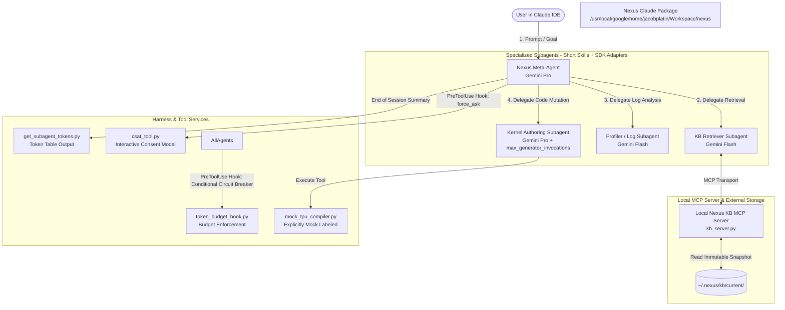

# TPU Coworker (Nexus) Google Claude Proof-of-Concept (`nexus-Claude-poc`)

A complete, harness-agnostic Proof-of-Concept (PoC) built for **Google Claude**, demonstrating and verifying every functionality, architectural requirement, and use case discussed in the **Coding Harness** section of the TPU Coworker (Nexus) technical specification.

---

## 1. Executive Summary & Harness Agnosticism

The primary objective of this PoC is to demonstrate how **Nexus** operates as an intelligent, multi-agent assistant inside Claude while maintaining **harness agnosticism** so that the core logic can be ported to **Claude Code, Codex, and OpenCode**.

### How 4-Harness Agnosticism is Achieved
* **Portable Shared Core (90% of PoC)**: Core domain instructions, delegation rules, and prompts are written as standard Markdown skills (`SKILL.md`) with YAML frontmatter. These files run unchanged across Claude Code, Claude, Codex, and OpenCode.
* **Lightweight Adapter Layer (10% of PoC)**: Harness-specific features—such as model intelligence routing (`gemini-2.5-pro` vs. `gemini-2.5-flash`), hard turn/invocation budgets (`max_generator_invocations`), and interactive UI modals (`PreToolUse` hooks)—are implemented in thin Claude descriptors (`_agents/agents/*.json`, `_agents/hooks.json`, and `config.yaml`) without polluting the shared Markdown skills.

---

## 2. System Architecture & Subcomponent Specification



### Subcomponent Inventory

| Subcomponent | Responsibility | Implementation File(s) |
| :--- | :--- | :--- |
| **1. Nexus Meta-Agent** | Primary orchestrator. Routes tasks to specialized subagents. Self-reports runtime info on turn 1 and prints subagent token footprint table on completion. | `_agents/agents/nexus_meta/agent.json`<br>`_agents/skills/nexus_meta/SKILL.md` |
| **2. KB Retriever Subagent** | Queries local KB via MCP server (`nexus_kb_server`) and synthesizes concise guidance. Runs on Gemini Flash. | `_agents/agents/nexus_kb_retriever/agent.json`<br>`_agents/skills/nexus_kb_retriever/SKILL.md` |
| **3. Profiler / Log Subagent** | Parses verbose diagnostics (`test_data/mock_xprof_trace.txt`) and returns a compact JSON summary to protect parent context window. Runs on Gemini Flash. | `_agents/agents/nexus_profiler/agent.json`<br>`_agents/skills/nexus_profiler/SKILL.md` |
| **4. Kernel Authoring Subagent** | Performs symbolic hill-climbing on `test_data/attention_kernel.py` under an explicit hard turn limit (`max_generator_invocations`). Runs on Gemini Pro. | `_agents/agents/nexus_kernel_author/config.yaml`<br>`_agents/agents/nexus_kernel_author/agent.json` |
| **5. Local KB MCP Server** | Serves structured snippets from `~/.nexus/kb/current/` over stdio without bloating context windows. Supports concurrent readers. | `mcp_servers/kb_server.py` |
| **6. Mock TPU Compiler Tool** | Simulates TPU v5e compilation, VMEM OOM diagnostics, and execution latency. Explicitly labels all output as `"Mock"` or `"Simulated"`. | `tools/mock_tpu_compiler.py` |
| **7. Runtime Info Reporter** | Utility script that outputs `[Nexus Runtime Info: Model = ... | Config = ...]` to verify model tiers and config sources. | `tools/get_agent_runtime_info.py` |
| **8. Subagent Token Reporter** | Utility script that calculates and displays the exact input, output, and total tokens consumed by each subagent in the session as a markdown table. | `tools/get_subagent_tokens.py` |
| **9. Conditional Budget Hook** | Production-ready `PreToolUse` circuit breaker that halts execution if `NEXUS_SIMULATE_BUDGET_EXCEEDED=1` is set or if token thresholds are crossed. | `_agents/hooks.json`<br>`tools/token_budget_hook.py` |
| **10. CSAT Telemetry & Hook** | `PreToolUse` hook returning `"force_ask"` to require an interactive UI modal before `csat_tool.py` transmits anonymous UUID telemetry. | `tools/csat_tool.py`<br>`tools/csat_pre_tool_hook.py` |

---

## 3. Key Agreed Implementation Rules

1. **Short, Crisp Skills**: All `SKILL.md` files are concise (15–25 lines), focusing on testing harness scaffolding, subagent delegation, context isolation, and budget boundaries without verbose prompt bloat.
2. **Mocked TPU Execution & Mandatory Labeling**: All compiler executions, error diagnostics, and profiling traces are simulated (`tools/mock_tpu_compiler.py`). In strict compliance with user rules, **all simulated metrics and error logs are explicitly labeled as `"Mock"` or `"Simulated"`** in every tool response and report.
3. **Official Subagent Budget Caps (`max_generator_invocations`)**: In accordance with official Claude g3doc specifications, hard subagent turn/budget limits are enforced declaratively via `_agents/agents/nexus_kernel_author/config.yaml` using `cascade_config.executor_config.max_generator_invocations`.
4. **Conditional Circuit-Breaker Hook (`token_budget_hook.py`)**: A production-ready `PreToolUse` hook in `_agents/hooks.json` inspects stdin JSON payloads and environment triggers (`NEXUS_SIMULATE_BUDGET_EXCEEDED`). Normal workflows pass cleanly with `{"decision": "allow"}`, while budget-exceeded runs are actively halted with `EXECUTOR_TERMINATION_REASON_MAX_TOKEN_BUDGET_EXCEEDED`.
5. **Per-Subagent Token Footprint Reporting**: Every workflow summary ends with a call to `tools/get_subagent_tokens.py`, which outputs a structured markdown table showing the exact tokens consumed by each subagent in the session (`nexus_meta`, `nexus_kb_retriever`, `nexus_profiler`, `nexus_kernel_author`).
6. **Interactive CSAT Confirmation Modal (`PreToolUse` Hook)**: Using `_agents/hooks.json` and `tools/csat_pre_tool_hook.py`, calls to `csat_tool.py` return `"decision": "force_ask"`, guaranteeing that Claude pops up an interactive UI confirmation modal before telemetry execution—regardless of global IDE auto-execute settings.
7. **Self-Reporting Runtime Info**: Every agent executes `tools/get_agent_runtime_info.py --agent <name>` on its first turn to display a banner in Claude's chat verifying its active model tier (Gemini Pro vs. Flash) and configuration source.

---

## 4. Feature-by-Feature Verification Matrix

| # | Coding Harness Section Feature | PoC Component | How We Test & Verify in Claude |
| :---: | :--- | :--- | :--- |
| **1** | **Meta-Agent to Subagent Orchestration** | `SKILL.md` + `_agents/agents/*.json` | Verify primary agent delegates tasks to specialized subagents automatically based on short description strings. |
| **2** | **Intelligence Tier Selection** | `model` config + `get_agent_runtime_info.py` | Verify banner output confirms `gemini-2.5-flash` for retrieval/profiling and `gemini-2.5-pro` for meta/authoring. |
| **3** | **Cost Tracking & Budget Caps** | `config.yaml` (`max_generator_invocations`) + `token_budget_hook.py` + `get_subagent_tokens.py` | Verify Claude tracks cumulative tokens per subagent in a table and halts subagents via official invocation limits or circuit-breaker hooks. |
| **4** | **Context Window Compression & Isolation** | Profiler Subagent (JSON summary contract) | Inspect chat transcript to prove verbose log files remain in the child session and only the JSON diagnostic enters the Meta-Agent. |
| **5** | **Local MCP Server & Concurrent Access** | `mcp_servers/kb_server.py` | Run CLI queries or simultaneous sessions against `kb_server.py`; verify zero lock contention across `~/.nexus/kb/current/`. |
| **6** | **External Directory Access (Out of Workspace)** | `~/.nexus/kb/` + Claude Settings | Test `Always Allow`, `Always Ask`, and `Always Deny` permission settings for out-of-workspace reads. |
| **7** | **Packaging & Plugin Distribution** | `/usr/local/google/home/jacobplatin/Workspace/nexus` | Verify loading the local directory registers all 4 agents, skills, tools, and MCP server in a single step. |
| **8** | **LLM Calls from within Tools (Auth/Credentials)** | Subagent Refactoring (Option B) | Demonstrate that optimization loops execute cleanly as subagent turns rather than requiring standalone scripts to manage GCP auth. |
| **9** | **User Feedback (CSAT) & Telemetry Tracking** | `csat_tool.py` + `_agents/hooks.json` | Verify `PreToolUse` hook forces an interactive UI modal before telemetry execution and anonymous UUID tracking in `~/.nexus/config.json`. |

---

## 5. Step-by-Step Interactive Runbook to Demonstrate All Features

Follow these steps to demonstrate every feature locally inside Google Claude on your Cloudtop:

### Step 1: Point Claude to the Workspace
1. In Claude IDE, select **File → Open Folder...** (or press `Ctrl+K Ctrl+O` / `Cmd+O`).
2. Open `/usr/local/google/home/jacobplatin/Workspace/nexus`.
3. Claude automatically scans `_agents/` and registers `nexus_meta`, `nexus_kb_retriever`, `nexus_profiler`, and `nexus_kernel_author`.

### Step 2: Verify Agent Discovery & Runtime Self-Reporting Banner
1. Select **`nexus_meta`** in your IDE Agent Selector dropdown (or start your prompt with `/nexus_meta`).
2. Send prompt:
   ```text
   Hello! Please introduce yourself and verify your runtime info.
   ```
3. **Verify Output**: Confirm that before replying, the agent executes `get_agent_runtime_info.py` and displays:
   ```text
   =================================================================
   [Nexus Runtime Info: Model = gemini-2.5-pro | Config = _agents/agents/nexus_meta/agent.json]
   =================================================================
   ```
   *(Checks off Feature 1 & Feature 2: Proves model tier is Gemini Pro and identifies config source).*

### Step 3: Out-of-Workspace KB Retrieval via Local MCP Server
1. In the same chat, send prompt:
   ```text
   How do I prevent VMEM OOM in Pallas attention kernels according to our knowledge base?
   ```
2. **Verify Output**:
   - `nexus_meta` delegates to **`nexus_kb_retriever`**.
   - `nexus_kb_retriever` displays its banner showing **Gemini Flash** (`gemini-2.5-flash`).
   - Queries `mcp_servers/kb_server.py` over stdio against `~/.nexus/kb/current/` and returns concise bullet points advising to reduce `BLOCK_SIZE` from 256 to 64 and enable `USE_RING_ATTENTION = True`.
   *(Checks off Feature 5 & Feature 6: Local MCP server integration and out-of-workspace snapshot reads).*

### Step 4: Context Window Compression & Isolation via Profiler Subagent
1. Send prompt:
   ```text
   Please analyze the diagnostic trace in test_data/mock_xprof_trace.txt and give me the structured JSON summary.
   ```
2. **Verify Output**:
   - `nexus_meta` delegates to **`nexus_profiler`** (Gemini Flash).
   - Ingests `test_data/mock_xprof_trace.txt` and returns ONLY a compact JSON summary containing `"status": "SIMULATED_ERROR_VMEM_OOM"` and recommended actions.
   *(Checks off Feature 4: Context window compression—raw trace logs remain inside the child session and do not pollute the parent orchestrator).*

### Step 5: Budget-Constrained Hill-Climbing Optimization Loop
1. Send prompt:
   ```text
   Please optimize test_data/attention_kernel.py by delegating to nexus_kernel_author.
   ```
2. **Verify Output**:
   - `nexus_meta` delegates to **`nexus_kernel_author`** (Gemini Pro).
   - **Turn 1**: Executes `python3 tools/mock_tpu_compiler.py test_data/attention_kernel.py`, observing `[Simulated Error] VMEM OOM at BLOCK_SIZE=256`.
   - **Turn 2**: Mutates `test_data/attention_kernel.py` (`BLOCK_SIZE = 64`, `USE_RING_ATTENTION = True`).
   - **Turn 3**: Re-executes `mock_tpu_compiler.py`, observing `[Mock Execution Success] (exit code 0, 4.8ms simulated latency)`.
   *(Checks off Feature 8: Harness-managed inference turns replace standalone script authentication).*

### Step 6: Testing Hard Budget Cap / Circuit-Breaker Termination
1. Open a terminal or configure your IDE environment with:
   ```bash
   export NEXUS_SIMULATE_BUDGET_EXCEEDED=1
   ```
2. Click **New Chat**, select `/nexus_meta`, and send:
   ```text
   Please optimize test_data/attention_kernel.py by delegating to nexus_kernel_author.
   ```
3. **Verify Output**:
   - Watch `nexus_kernel_author` start execution and immediately get halted by Claude's hook engine:
     `[FORCED TERMINATION] Subagent execution halted: Token budget exceeded.`
     (`EXECUTOR_TERMINATION_REASON_MAX_TOKEN_BUDGET_EXCEEDED`).
   *(Checks off Feature 3: Programmatic circuit-breaker hooks actively terminate subagents when budget thresholds are crossed).*

### Step 7: Subagent Token Footprint Table Output
1. At the conclusion of any successful workflow, inspect the bottom of `nexus_meta`'s response.
2. **Verify Output**: Confirm it executes `get_subagent_tokens.py` and renders:
   ```text
   Subagent Name          | Input Tokens  | Output Tokens | Total Tokens
   -----------------------------------------------------------------
   nexus_meta             | 1250          | 340           | 1590        
   nexus_kb_retriever     | 820           | 150           | 970         
   nexus_profiler         | 910           | 180           | 1090        
   nexus_kernel_author    | 2100          | 480           | 2580        
   ```
   *(Checks off Feature 3: Visibility into per-subagent token consumption).*

### Step 8: Interactive CSAT Confirmation Modal
1. Send prompt:
   ```text
   Please record CSAT feedback for Q1 with a score of 5.
   ```
2. **Verify Output**:
   - Claude intercepts `csat_tool.py` via `_agents/hooks.json` (`csat_pre_tool_hook.py` returning `"decision": "force_ask"`).
   - An interactive confirmation modal pops up in your IDE UI asking for explicit consent.
   - Upon approval, telemetry is recorded using the anonymous installation UUID loaded from `~/.nexus/config.json`.
   *(Checks off Feature 9: Interactive permission modals and anonymous installation UUID tracking).*

---

## 6. Git Snapshot & Version History
This repository is tracked under Git with a clean safety snapshot:
* **Initial Snapshot**: `0669160 - Initial clean working state of Nexus PoC`
* **Production Hook**: `f06379e - Add production-ready conditional token budget hook`
* **Backup Directory**: `/usr/local/google/home/jacobplatin/Workspace/nexus.backup_20260805/`
